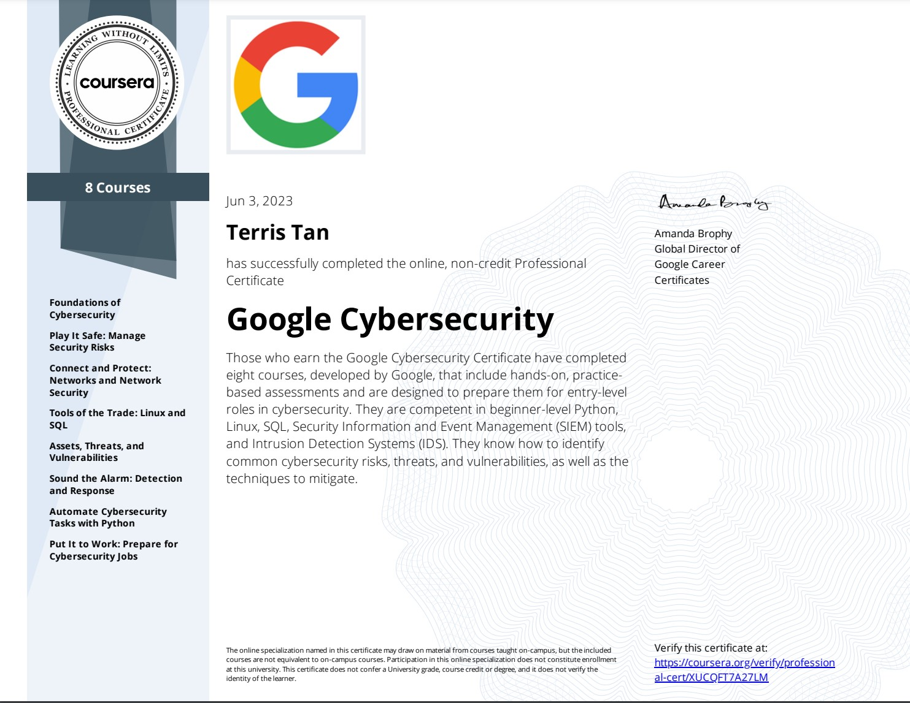

## [Google Cybersecurity Professional Certificate](https://www.coursera.org/professional-certificates/google-cybersecurity)

 

 

### About this Professional Certificate

Prepare for a new career in the high-growth field of cybersecurity, no degree or experience required. Get professional training designed and delivered by subject matter experts at Google and have the opportunity to connect with top employers.

Organizations must continuously protect themselves and the people they serve from cyber-related threats, like fraud and phishing. They rely on cybersecurity to maintain the confidentiality, integrity, and availability of their internal systems and information. Cybersecurity analysts use a collection of methods and technologies to safeguard against threats and unauthorized access — and to create and implement solutions should a threat get through.

During the 8 courses in this certificate program, you’ll learn from cybersecurity experts at Google and gain in-demand skills that prepare you for entry-level roles like cybersecurity analyst, security operations center (SOC) analyst, and more. At under 10 hours per week, you can complete the certificate in less than 6 months.

Upon completion of the certificate, you can directly apply for jobs with Google and over 150 U.S. employers, including American Express, Deloitte, Colgate-Palmolive, Mandiant (now part of Google Cloud), T-Mobile, and Walmart.

The Google Cybersecurity Certificate helps prepare you for the CompTIA Security+ exam, the industry leading certification for cybersecurity roles. You’ll earn a dual credential when you complete both.

Applied Learning Project

This program includes 170 hours of instruction and hundreds of practice-based assessments and activities that simulate real-world cybersecurity scenarios that are critical for success in the workplace. Through a mix of videos, assessments, and hands-on labs, you’ll become familiar with the cybersecurity tools, platforms, and skills required for an entry-level job.

**Skills you’ll gain will include:** Python, Linux, SQL, Security Information and Event Management (SIEM) tools, Intrusion Detection Systems (IDS), communication, collaboration, analysis, problem solving and more!

Additionally, each course includes portfolio activities through which you’ll showcase examples of cybersecurity skills that you can share with potential employers. Acquire concrete skills that top employers are hiring for right now.
